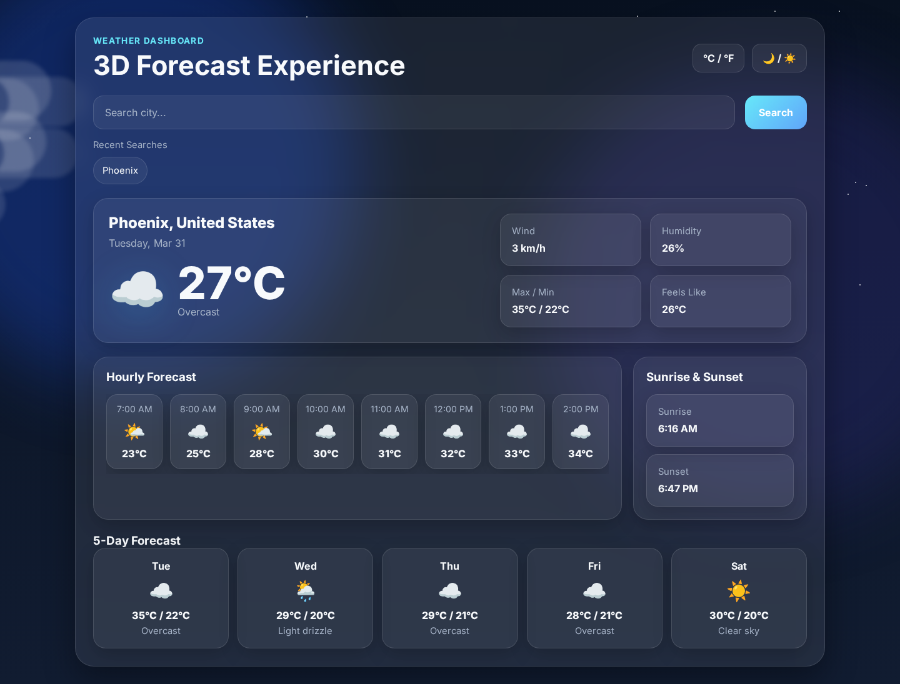
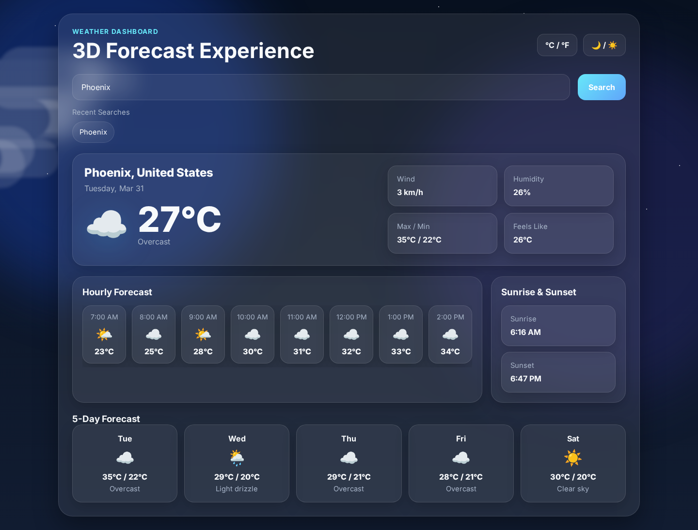
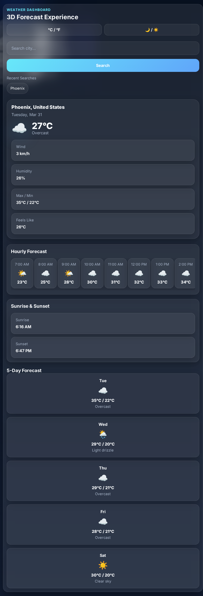

# 🌤️ 3D Weather Dashboard

[](https://3d-weather-dashboard.netlify.app)


A **modern 3D-inspired weather dashboard** built with **HTML, CSS, and JavaScript**.  
It provides **real-time weather data**, **hourly forecasts**, and **dynamic animated weather effects** inspired by modern weather applications.

---

## 🚀 Live Demo

[](https://3d-weather-dashboard.netlify.app)

---

## 🖼️ Project Preview

<a href="https://3d-weather-dashboard.netlify.app" target="_blank">
  
</a>

<p align="center">
  Click the GIF above to open the live app.
</p>
---

## 📸 Screenshots

### Home Screen


### Forecast View


### Mobile View


# ✨ Features

🔎 **City Search**

Search weather conditions for any city in the world.

🌡️ **Current Weather**

Displays:

- temperature
- weather condition
- wind speed
- humidity
- feels-like temperature

📅 **5-Day Forecast**

Displays the upcoming weather predictions.

🕒 **Hourly Forecast**

Scrollable hourly temperature forecast.

🌅 **Sunrise & Sunset**

Shows sunrise and sunset times for the selected city.

☁️ **Animated Weather Effects**

Dynamic visuals based on weather conditions:

- moving clouds
- falling rain
- lightning flashes
- dynamic sky background

♻️ **Recent Search History**

Stores recently searched cities using **Local Storage**.

🌍 **Temperature Toggle**

Switch between **Celsius and Fahrenheit**.

🌙 **Dark / Light Mode**

Toggle between themes.

---

# 🛠️ Tech Stack

| Technology | Purpose |
|------------|--------|
| HTML5 | Structure |
| CSS3 | Styling and animations |
| JavaScript (ES6+) | Application logic |
| Open-Meteo API | Weather data |
| Open-Meteo Geocoding API | City search |
| Local Storage | Save search history |

---


# 📂 Project Structure

```
3d-weather-dashboard
│
├── screenshots
│   ├── home.png
│   ├── forecast.png
│   ├── mobile.png
│   └── storm.png
│
├── index.html
├── style.css
├── script.js
└── README.md
```

---

# 🚀 Getting Started

Clone the repository

```bash
git clone https://github.com/achrafdev89/weather-dashboard.git
```

Navigate into the project

```bash
cd weather-dashboard
```

Run the app

Open **index.html** in your browser.

For development, it is recommended to use **VS Code Live Server**.

---

# 💡 What I Learned

This project helped me practice:

- integrating APIs into web applications
- asynchronous JavaScript
- responsive UI design
- dynamic UI animations
- DOM manipulation
- storing user data with Local Storage

---

# 🔮 Future Improvements

Planned upgrades:

- 📍 Detect user location automatically
- 🌫️ Air quality index
- 🎥 Weather video backgrounds
- 📊 Weather charts
- 🔔 Severe weather alerts
- 📱 Progressive Web App (PWA)

---

# 👨‍💻 Author

**Achraf Chibane**

Junior Front-End Developer

GitHub  
https://github.com/achrafdev89

LinkedIn  
https://linkedin.com/in/achraf-chibane

---

# ⭐ Support

If you like this project, consider giving it a **star ⭐ on GitHub**.
